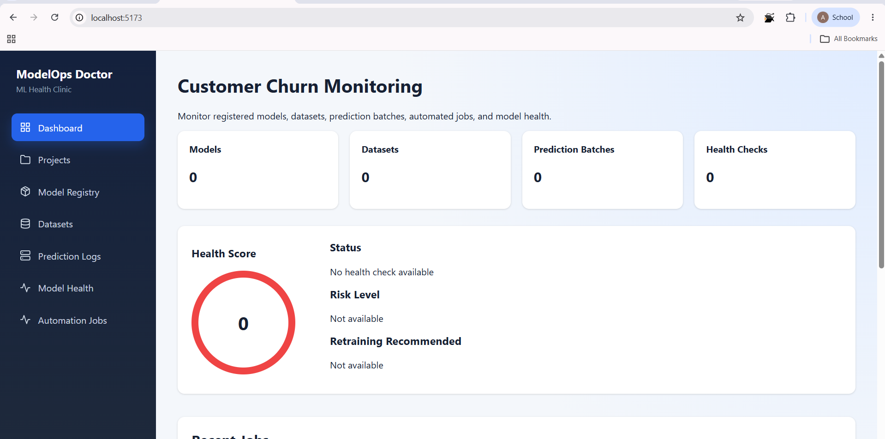
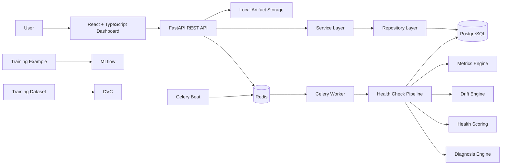
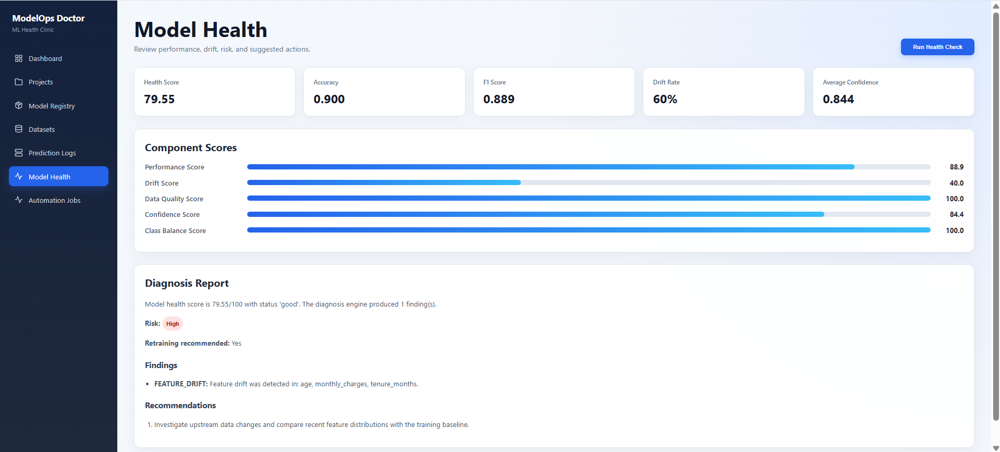
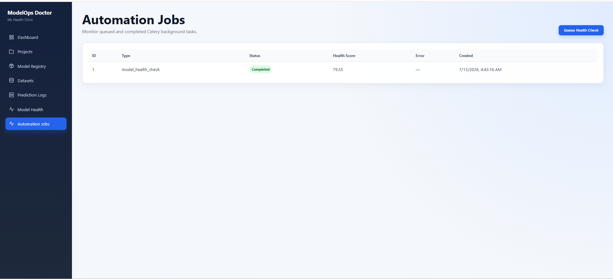

# ModelOps Doctor

A full-stack MLOps monitoring platform for registering machine-learning models, profiling datasets, ingesting prediction logs, detecting data drift, calculating model-health scores, generating diagnosis reports, and automating monitoring workflows.



## Overview

ModelOps Doctor acts as an **ML Health Clinic**. It connects model metadata, baseline datasets, and production prediction logs to answer practical monitoring questions:

- Is model performance still acceptable?
- Have production feature distributions drifted from training data?
- Are predictions becoming less confident?
- Does the model need investigation or retraining?
- Can health checks run asynchronously and on a schedule?

The included customer-churn example produces a health score of **79.55/100**, detects drift in `age`, `monthly_charges`, and `tenure_months`, assigns a **high** risk level, and recommends retraining.

## Key Features

### Project and Model Management

- Create ML monitoring projects
- Register multiple model versions
- Store algorithms, frameworks, training metrics, artifact locations, and status
- Prevent duplicate model-version registrations

### Dataset Management

- Upload training, validation, testing, and production CSV datasets
- Validate file type, size, target column, and content
- Generate SHA-256 content and schema hashes
- Calculate row and column counts
- Profile missing values and column types
- Produce numeric and categorical summaries
- Calculate target-class distributions

### Prediction Log Ingestion

- Upload labeled or unlabeled prediction CSV files
- Validate timestamps, predicted labels, and confidence values
- Persist batch metadata and individual prediction records
- Store feature payloads as JSON
- Prevent duplicate prediction-file ingestion

### Monitoring and Diagnosis

- Accuracy, precision, recall, F1-score, ROC-AUC, and confusion matrix
- Per-class performance metrics
- Confidence statistics and low-confidence rate
- Numeric drift using Population Stability Index
- Distribution change testing with the Kolmogorov-Smirnov test
- Categorical drift using total variation distance
- Weighted model-health score from 0 to 100
- Rule-based risk classification, findings, recommendations, and retraining guidance

### Automation and Operations

- Redis-backed Celery task queue
- Background model-health checks
- Celery Beat scheduling foundation
- Automation-job lifecycle tracking: queued, running, completed, and failed
- Dashboard aggregation API
- Structured JSON logging
- Request-ID and response-time headers
- CORS and centralized exception handling
- Docker Compose orchestration
- GitHub Actions backend CI

### MLOps Tooling

- MLflow experiment tracking, metrics, parameters, tags, and artifacts
- DVC dataset versioning and reproducible dataset restoration
- Alembic database migrations
- Ruff linting and formatting
- pytest and coverage reporting

## Technology Stack

### Backend

- Python 3.11
- FastAPI
- SQLAlchemy 2 with asyncpg
- PostgreSQL 16
- Alembic
- Pydantic Settings
- pandas, NumPy, SciPy, and scikit-learn

### Automation

- Redis
- Celery
- Celery Beat

### Frontend

- React
- TypeScript
- Vite
- Axios
- React Router
- Recharts
- React Icons
- Nginx

### Infrastructure and MLOps

- Docker and Docker Compose
- GitHub Actions
- MLflow
- DVC
- pytest, pytest-cov, and Ruff

## Architecture



## Repository Structure

```text
ModelOps_Doctor_Project/
├── backend/
│   ├── alembic/
│   ├── app/
│   │   ├── api/routes/
│   │   ├── core/
│   │   ├── db/
│   │   ├── mlops/
│   │   ├── models/
│   │   ├── repositories/
│   │   ├── schemas/
│   │   ├── services/
│   │   └── workers/
│   ├── tests/
│   ├── Dockerfile
│   └── requirements.docker.txt
├── frontend/
│   ├── src/
│   │   ├── api/
│   │   ├── components/
│   │   ├── layouts/
│   │   ├── pages/
│   │   └── types/
│   ├── Dockerfile
│   └── nginx.conf
├── ml_examples/
│   ├── metadata/
│   ├── sample_prediction_logs/
│   └── train_churn_model.py
├── docs/
├── docker-compose.yml
└── README.md
```

## Quick Start with Docker Compose

### Prerequisites

- Docker Desktop
- Git

### 1. Clone the repository

```bash
git clone <your-repository-url>
cd ModelOps_Doctor_Project
```

### 2. Build and start the platform

```bash
docker compose up --build -d
```

### 3. Check service status

```bash
docker compose ps
```

Expected services:

- `modelops-postgres`
- `modelops-redis-compose`
- `modelops-api`
- `modelops-worker`
- `modelops-beat`
- `modelops-frontend`

### 4. Open the application

- Frontend: <http://localhost:5173>
- Swagger API documentation: <http://localhost:8000/docs>
- API health endpoint: <http://localhost:8000/api/v1/health>

### 5. Stop the platform

```bash
docker compose down
```

Docker volumes are preserved. To delete all container data intentionally:

```bash
docker compose down -v
```

## Local Development

### 1. Create and activate the Python environment

```powershell
py -3.11 -m venv backend\.venv
backend\.venv\Scripts\Activate.ps1
python -m pip install -r backend\requirements.txt
```

### 2. Configure environment variables

```powershell
Copy-Item .env.example .env
```

Default local PostgreSQL settings:

```dotenv
POSTGRES_USER=modelops_user
POSTGRES_PASSWORD=modelops_password
POSTGRES_DB=modelops_doctor
POSTGRES_HOST=localhost
POSTGRES_PORT=5432
REDIS_URL=redis://localhost:6379/0
CELERY_BROKER_URL=redis://localhost:6379/0
CELERY_RESULT_BACKEND=redis://localhost:6379/1
```

Do not commit the real `.env` file.

### 3. Apply database migrations

```powershell
cd backend
python -m alembic upgrade head
```

### 4. Start FastAPI

```powershell
python -m uvicorn app.main:app --reload
```

### 5. Start Redis

Create the container once:

```powershell
docker run -d --name modelops-redis -p 6379:6379 redis:7-alpine
```

On later runs:

```powershell
docker start modelops-redis
docker exec modelops-redis redis-cli ping
```

### 6. Start the Celery worker on Windows

```powershell
cd backend
python -m celery -A app.workers.celery_app:celery_app worker --loglevel=info --pool=solo
```

### 7. Start Celery Beat

```powershell
cd backend
python -m celery -A app.workers.celery_app:celery_app beat --loglevel=info
```

### 8. Start the React frontend

```powershell
cd frontend
npm install
npm run dev
```

Open <http://localhost:5173>.

## End-to-End Demo Workflow

Use the frontend or Swagger UI to complete this sequence:

1. Create `Customer Churn Monitoring` with target column `churn`.
2. Register `Customer Churn Classifier` version `1.0.0`.
3. Upload `ml_examples/sample_churn_training.csv` as the training baseline.
4. Upload `ml_examples/sample_prediction_logs/churn_predictions_v1.csv`.
5. Run a synchronous model-health check.
6. Queue a background health check from the Automation Jobs page.
7. Review the dashboard, drifted features, diagnosis, and recommendations.

Expected demo outcome:

```text
Accuracy:               0.900
Precision:              1.000
Recall:                 0.800
F1-score:               0.889
Average confidence:     0.844
Drifted features:       age, monthly_charges, tenure_months
Health score:           79.55 / 100
Health status:          good
Risk level:             high
Retraining recommended: yes
```

> The included dataset is intentionally small and exists to demonstrate the complete MLOps workflow. The reported metrics are not production benchmarks.

## Main API Endpoints

### Projects

```text
POST   /api/v1/projects
GET    /api/v1/projects
GET    /api/v1/projects/{project_id}
DELETE /api/v1/projects/{project_id}
```

### Model Registry

```text
POST   /api/v1/projects/{project_id}/models
GET    /api/v1/projects/{project_id}/models
GET    /api/v1/models/{model_id}
DELETE /api/v1/models/{model_id}
```

### Datasets

```text
POST   /api/v1/projects/{project_id}/datasets
GET    /api/v1/projects/{project_id}/datasets
GET    /api/v1/datasets/{dataset_id}/profile
```

### Prediction Logs

```text
POST   /api/v1/projects/{project_id}/prediction-batches
GET    /api/v1/projects/{project_id}/prediction-batches
GET    /api/v1/prediction-batches/{batch_id}
```

### Health Monitoring

```text
POST   /api/v1/projects/{project_id}/health-checks/run
GET    /api/v1/projects/{project_id}/health-checks/latest
GET    /api/v1/health-checks/{health_check_id}/report
```

### Automation and Dashboard

```text
POST   /api/v1/projects/{project_id}/health-checks/background
GET    /api/v1/jobs
GET    /api/v1/jobs/{job_id}
GET    /api/v1/projects/{project_id}/dashboard
```

## Health-Score Formula

ModelOps Doctor calculates a weighted score:

```text
35% Performance
25% Drift Stability
20% Data Quality
10% Prediction Confidence
10% Class Balance
```

Health statuses:

```text
90–100  excellent
75–89   good
60–74   warning
40–59   risky
0–39    critical
```

A model may have a `good` numerical score while still receiving a `high` diagnosis risk when a critical rule—such as substantial feature drift—is triggered.

## MLflow Workflow

Run model training:

```powershell
python ml_examples\train_churn_model.py
```

For runs stored in the local file backend:

```powershell
$env:MLFLOW_ALLOW_FILE_STORE="true"
python -m mlflow ui --backend-store-uri ./mlruns --port 5000
```

Open <http://127.0.0.1:5000>.

The training example logs:

- Model parameters
- Classification metrics
- Dataset artifact
- Serialized model pipeline
- Prediction log
- Model metadata

## DVC Workflow

Restore the tracked training dataset:

```powershell
dvc pull
```

Check its status:

```powershell
dvc status
```

Push a new dataset version:

```powershell
dvc add ml_examples\sample_churn_training.csv
dvc push
git add ml_examples\sample_churn_training.csv.dvc
git commit -m "data: update churn training dataset"
```

The included DVC remote is local and intended for demonstration. Configure cloud storage for team or production use.

## Quality Checks

### Backend

```powershell
cd backend
python -m ruff check app tests alembic\env.py
python -m ruff format --check app tests alembic\env.py
python -m pytest
python -m alembic current
```

### Frontend

```powershell
cd frontend
npm run build
```

### Docker

```powershell
docker compose config
docker compose build
docker compose up -d
docker compose ps
```

## CI/CD

The GitHub Actions backend workflow:

- Starts PostgreSQL and Redis services
- Installs Python dependencies
- Runs Ruff linting
- Checks Ruff formatting
- Applies Alembic migrations
- Runs pytest with coverage
- Builds the backend Docker image

Workflow file:

```text
.github/workflows/backend-ci.yml
```

## Screenshots

Create `docs/images/` and save project screenshots with these names:

```text
docs/images/dashboard.png
docs/images/projects.png
docs/images/model-registry.png
docs/images/datasets.png
docs/images/model-health.png
docs/images/automation-jobs.png
```

Recommended README gallery:

```markdown



```

## Known MVP Limitations

- The frontend currently uses project ID `1` for the primary demo workflow.
- Authentication and role-based access control are not included.
- Local storage is used for uploaded CSV files and model artifacts.
- Scheduled monitoring policies are a foundation for future configuration.
- The sample churn dataset is intentionally small.
- The local DVC remote is for demonstration, not shared production storage.
- Monitoring is currently focused on classification use cases.

## Future Improvements

- Dynamic project selection throughout the frontend
- Authentication and role-based authorization
- S3 or Azure Blob Storage for uploaded artifacts
- Configurable scheduled monitoring policies
- Email, Teams, or Slack alerts
- Regression-model monitoring
- Explainability with SHAP
- Model comparison and promotion workflows
- Larger integration-test suite
- Kubernetes deployment with observability

## Author

**Akabir Abbas**

BS Computer Science graduate specializing in artificial intelligence, machine learning, backend engineering, and MLOps.

## License

Add a license before public distribution. The MIT License is a suitable option for an open-source portfolio project.
